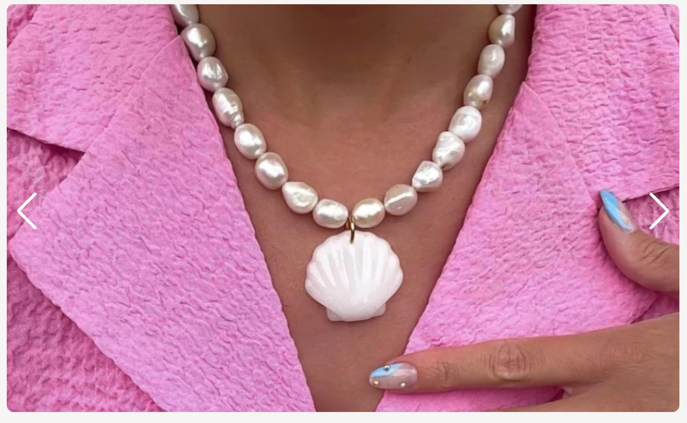

  

[Sun&Peaches Ecommerce](https://sun-and-peaches-72eca0ee8a6a.herokuapp.com/) represents a unique fashion jewelry brand characterized by its distinctive design and timeless essence. Enriched with an array of colors, mermaids, and stars, it offers a canvas for creative combinations, appealing to individuals who cherish personal expression and freedom.  

The inspiration for this project came from my sister's desire to have a platform like this. She wanted a place where people could explore and purchase unique and stylish jewelry items, leading me to create the Sun&Peaches ecommerce website.  

I built this ecommerce project for Sun&Peaches using the knowledge I gained from the course "[Python Django Ecommerce | Advanced Django Web App From Basic](https://www.udemy.com/course/django-ecommerce-project-based-course-python-django-web-development/)" I used technologies like HTML, CSS, Django, Python, and JavaScript to create a user-friendly website where you can explore and purchase their fashionable jewelry items.   

Technologies Used:  


    
<br>
[Here you have a live version of the project.](https://sun-and-peaches-72eca0ee8a6a.herokuapp.com/)  

When testing interactively, use a card number, such as [4242 4242 4242 4242](https://stripe.com/docs/testing?testing-method=card-numbers#visa). Enter the card number in the Dashboard or in any payment form.
- Use a valid future date, such as **12/34**.
- Use any three-digit CVC (four digits for American Express cards).
- Use any value you like for other form fields.   

---  

## Table of Contents

1. <details>
   <summary><a href="#ux">UX</a></summary>

   - [Visitor Goals](#visitor-goals)
   - [Business Goals](#business-goals)
   - [User Stories](#user-stories)
   - [Agile Development](#agile-development)
   - [Marketing](#marketing)

   </details>
   
2. <details>
    <summary><a href="#visual-design">Design</a></summary>

      - [Wireframes](#wireframes)
      - [Database Schema](#database-schema)
      - [Colors](#colors)
      - [Fonts](#fonts)
      - [Icons](#icons)

</details>

1. <details>
   <summary><a href="#styling-formatting-and-features">Styling, Formating and Features</a></summary> 
    
    - [Future Features](#future-features)

</details>

4.  <details>
    <summary><a href="#validation-and-testing">Validation and Testing</a></summary>
    <ul>
    <li><a href="#validation">Validation</a></li>
    <li><a href="#testing">Testing</a></li>

    <li>
    <details>
    <summary><a href="#bugs">Bugs</a></summary>

    - [Fixed Bugs](#fixed-bugs)
    </details>
    </li>
    </ul>

</details>
  
5. <details>
    <summary> <a href="#deployment">Deployment</a></summary>

      - [Local Deployment](#local-deployment)
      - [Heroku Deployment](#heroku-deployment)

</details>

6. <a href="#tools-and-platforms">Tools and Platforms</a>

7. <a href="#content-and-credits">Content and Credits</a>

8. <a href="#media">Media</a>
  
---  
  
## UX  

### Visitor Goals  
- Visitors of all ages interested in modern but dreamy jewelry - that is affordable
- Visitors who support slow fashion and sustainability
- Visitors who exclusively buy brands that harm none during the production process
- Visitors who support novelty, creativity and stepping out of a cliché
- Visitors who are seeking freedom and inspiration all the time in various colours and shapes in handmade products

### Business Goals  
- To introduce itself as a sustainable brand on the market 
- To make sure that its products are available in online purchase in every country 
- To always promote its philosophy of handcrafted goods 
- To promote its creativity, uniquness and simplicity at the same time 
- To attract visitors' attention with calm and warm atmosphere of its website
- To make the online shopping as simplest as possible
- To provide regular sales
- To position itself  as a trendsetter in slow fashion  domain  only  with intention of attracting new visitors  too  

### User Stories  
- As a **Site User** I can **view the homepage** so that **I can see the newest items in shop**  
- As a **Site Administrator** I can **manage user accounts** so that **I can maintain the integrity and security of the website and ensure a smooth user experience.**
- As a **Site User** I can **use search functionality** so that **I can find specific items in the shop**
- As a **Site User** I can **view a list of products** so that **I can browse and explore the list of products and find those that suit me**
- As a **Site User** I can **view detailed information about the product** so that **I can confirm that the product is suitable for me**
- As a **Site User** I can **view multiple images of product** so that **I can have better sense of product appearance**
- As a **Site User** I can **sign up for an account** so that **I can view my profile page**
- As a **Registered User,** I can **easily login and logout** so that **I can access my account information**
- As a **Registered User** I can **recover my password** so that **I can regain access to the account**
- As a **Site User** I can **receive a register confirmation email** so that **I am sure that registration went well**
- As a **Registered User** I can **view and update my account details** so that **I can keep information up to date**
- As a **Registered User** I can **leave reviews and ratings for products that I have bought** so that **I can share feedback with other customers**
- As a **Site User** I can **contact the owner through the contact form** so that **I can get more information, assistance or send complaints**
- As a **Site User** I can **filter products based on parameters(e.g. Brand)** so that **I can find specific items**
- As a **Site User** I can **easily sign up for a newsletter subscription** so that **I can receive updates on new products, promotions, sales**
- As a **Site User** I can **view a size guide for products** so that **I can choose right product size**
- As a **Site User** I can **view customer reviews of products** so that **I find out more about the quality of the product**
- As a **Registered User** I can **easily add product to the cart** so that **purchase is fast and simple as possible**
- As a **Registered User** I can **track my order history** so that **I have an overview of my previous purchases**
- As a **Registered User** I can **add products to my wishlist** so that **I can save them for future purchase**
- As a **Site Administrator** I can **access and manage all important options on the admin panel** so that **I can easily manage products, users, orders content**
- As a **Site Administrator** I can **add, delete, and update products on the front-end** so that **I should be able to access a user-friendly interface that allows me to do CRUD functionalities for products**
- As a **Registered User** I can **make secure payments using Stripe** so that **I can have confidence that my payment information is handled securely and my purchase is protected**
- As a **Site User** I can **seamlessly navigate the website with a clear header, navbar, and footer** so that **I can quickly navigate to what interests me and visit social networks**
- As a **Site Owner** I **need to have ReadMe document** so that **I have thorough and well-organized documentation for efficient website management**
- As a **Site Administrator** I can **create and manage product categories** so that **products are well organized and can be easily navigated**
- As a **Site Visitor** I can **easily navigate through product list** so that **I can browse through the entire product list fast**
- As a **Site Owner** I want **to have custom 403, 403_CSRF and 404 error pages** so that **visitors encountering these issues will have a better understanding of the problem.**
- As a **Site Owner** I want **to ensure that the codebase is well-organized, neatly formatted, and extensively commented** so that **it can be easily understood and maintained by other developers**
- As a **Registered User,** I can **change my password** so that **I can maintain the security of my account**
- As a **Site Administrator** I want **to have rich text editor** so that **I can send styled newsletter**
- As a **Registered User** I can **delete my own product review** so that **I can manage the content associated with my account**
- As a **Site Visitor** I want **the registration process to enforce strong password requirements** so that **ensure the security of my account**
- As a **Site User** I want **to see the total count of items in my shopping cart** so that **I can keep track of the quantity of products**.  

### Agile Development  
- During the development of the Sun&Peaches fashion jewelry e-commerce project, I followed an Agile approach to manage the project effectively.
- The project's development workflow was organised through GitHub Projects and Issues.
- Most of the time I focused on user stories to quickly plan the project due to time constraints
- Later in the development, I switched to the MOSCOW system to prioritize tasks better. This categorization method helped me decide what aspects were crucial (Must-Have), important (Should-Have), optional (Could-Have), or not needed (Won't-Have).
- I also started using GitHub Issues labels to organize tasks effectively, making it easier to see importance and type.
- I continuously assessed and adjusted the project. This allowed me to make real time changes based on feedback and insights.
- By applying Agile methodologies, I managed to create a functional e-commerce platform for Sun&Peaches. But, there is room for improvement to fully aligns with the brand's identity and meets all user requirements.

### Marketing  
- Marketing in slow fashion is also "slow" , soft and definitely not for the masses.
- The photos chosen here are supposed to attract free spirit visitors that are looking for inspiration in authenticity and creativity.
- All these in a subtle way, that doesn't require demands and doesn't set the patterns followed by crowds 
- Free shipping, in this case, would be the only option. Otherwise, I wouldn't represent anymore what I stand for.  

- I've created custom subscription app that efficiently delivers newsletters to our audience, enhancing our communication and engagement.
  
- I've created a Facebook mockup page for our Sun&Peaches jewelry store, encapsulating our brand's authentic charm and creative inspiration to resonate with our target audience
  

- I've strategically incorporated SEO-friendly keywords and crafted a captivating description that embodies Sun&Peaches' unique handcrafted jewelry inspired by nature, targeting free-spirited individuals seeking authenticity and creativity in their fashion choices
- Additionally, I've included a robots.txt and a sitemap.xml to optimize visibility on Google search engines.  

---  

## Design  

### Wireframes  
- The initial project wireframes. As they are created in the early planning stages, they will differ from the final project.  

  #### Desktop Wireframes   
     
     
     
     
      
  
  #### Mobile Wireframes   
     
     
     
     
      

### Database Schema  
- We've created an Entity-Relationship Diagram (ERD) as part of our planning process to map out the relationships between different data entities in the system. This ERD serves as a blueprint that guides the development of the project. As we continue to refine and enhance the platform, any potential modifications or updates to the ERD will help ensure that the deployed site remains aligned with our evolving goals and requirements.   
     

### Colors  
- I selected these pastel colors that contribute to the overall visual appeal of the Sun&Peaches.
- I chose peach like color (#ff9c7f) because it looked playful and energitic and making it ideal for main heading.
- Light green (#8cada4) was chosen because it brings harmonious nature feel.
- Light brown (#bea494) allows the content and visuals to stand out while maintaining a calm ambiance.
- Dark brown (#4c413b), wekk this pastel color is legable and readable.
- They might initially appear distinct, but when combined, they create a harmonious appearance.   
  

### Fonts  
- I chose [Quicksand Google Font](https://fonts.google.com/specimen/Quicksand?query=quick) for its modern and clean appearance. This font's readability and simplicity enhance the user experience, making content easy to read and comprehend.    

     
  
- For headings and important elements I chose [Laila Google Font](https://fonts.google.com/specimen/Laila?query=laila), as its elegant and distinctive style emphasizes key sections of the Sun&Peaches e-commerce.   

     

### Icons  
- Icons used on this website are from [SVG Repo](www.svgrepo.com)
- As Favicon and cursor I chose to use peach to create playful visual experience that aligns with the brand's identity.
- Peach cursor adds a touch of uniqueness to user interaction, enhancing the overall user experience.  
  

- For pointer cursor I opted for a sun to provide clear feedback to users when they hover over elements like buttons and links.  
    

- In the future, I plan to introduce a feature that allows users to choose between custom cursors and the standard cursors used on websites.
- This customization option will provide users with the flexibility to select their preferred cursor style.  

---  


## Styling, Formatting and Features   

### Styling, Formatting, Features

#### Design of Sun&Peaches:
- I decided to infuse lively colors into the design mix, creating a captivating blend.
- I went for gentle pastel shades to make everything look even better.
- The main title got a playful and energetic peachy hue (#ff9c7f) for a lively touch.
- To keep things in tune with nature, I picked a soothing light green shade (#8cada4).
- I added light brown (#bea494) to make important stuff stand out while keeping things calm.
- For easy reading, I added a dark brown shade (#4c413b).
- All these colors, though different, come together nicely for a balanced look.

#### Technologies Used:
- I skipped using Bootstrap to challenge myself with pure CSS.
- I ditched jQuery in favor of JavaScript to keep things simple and interactive.
- For Django views, I opted for function-based views instead of class-based that I've used in last project.
- To make sure everything's secure, I used the @login_required decorator and user_passes_test tests in Django's authentication system. This way, only the right users can access the right things.  

#### Home Page     
  

- In the header section, I've added essential links such as Home, Shop, and Contact as text links. With pure CSS and JS I made these links collapsing within a hamburger menu on smaller screens.
    
    
- For user profile dashboard, search, and cart functionalities, I've utilized commonly recognized [FontAwesome](https://fontawesome.com/) icons.
  
- For the search function, I opted to create an overlay with a centered search input that is prominently visible. To enhance the visibility of the search input, I applied a transparent brown overlay that complements the overall design of the site. 
    
- On the homepage, my aim was to greet users with a warm welcome message and provide a brief introduction to the Sun&Peaches ecommerce platform.
    
- Right after that, I included a captivating product carousel. Each image in the carousel is a link to the corresponding product, ensuring easy exploration 
     
- I've used for that purpose [Swiper JS](https://swiperjs.com/), which was easy to implement thanks to its excellent documentation.

- For  strategic touch, I added a subscription section that allows users to join and receive newsletters.
  

- I created a custom functionality that lets me send newsletters directly from the dashboard to all subscribed users, enhancing our marketing efforts.
  
- And improved it with [TinyMCE](https://www.tiny.cloud/) Rich Text Editor, so that sent emails have really styling.
- For the footer, I opted to provide additional details about Sun&Peaches, including information about the store, address, social media links, as well as quick links to product categories.  
  
- I utilized a CSS Grid to ensure that the design remains responsive across different devices and screen sizes.

#### Shop     

     
  
- The shop page was structured with a side panel featuring category filters, allowing users to easily navigate through different product types. 
  
- I've used context processors to ensure that category links are accessible throughout the entire website, enabling display of categories across different pages.
- On smaller screens, I chose to collapes filter section to optimize space, and I used Font Awesome icons with animation to make it more intersting.
  
  
- The main product list displays links to individual products.
- I added conditional rendering, if there aren no products message will be displayed
  
- I deliberately omitted the "Add to Cart" option on this page.   
- Instead, users are encouraged to click on products to access their detailed descriptions, especially for items with variations.   


- For the product detail page, I prioritized showcasing the product itself 
  
- For most of the part I've used CSS Flexbox, as my favourite, for responsive design
   

- Variations for products have been implemented; however, I realized that I overlooked the implementation of stock tracking for each variation. This will be addressed in the next update by adding a "stock" field to the Variation models and defining a method in the product model to calculate the total stock of all variations for that specific product.
- I implemented a review star system inspired by [Python Django Ecommerce | Advanced Django Web App From Basic](https://www.udemy.com/course/django-ecommerce-project-based-course-python-django-web-development/), ensuring that only users who have purchased the product can leave reviews. 
  
- All product reviews are stored in the database using a model specifically designed to handle reviews.
  
- I have implemented messages to be displayed to users who are not signed in or haven't purchased the product, ensuring that only signed-in users who have made a purchase are allowed to leave a review.
- For cases where a review has already been submitted, I've enabled the functionality to update the existing review. I accomplished this by creating a function based view called 'create_review' and securing it with the login decorator for more security.
- Additionally, users who have posted reviews are granted the ability to delete their reviews, with this functionality also protected by a login decorator.
   
- While initially planning to include an image gallery, it's currently scheduled for implementation in the future due to time constraints.
  
#### Contact Page     

- I have incorporated a contact page as an essential component of the website.
- I opted for a separate app to ensure easy scalability and potential future enhancements such as an AI chatbot
- This contact page allows users to send messages, and all the messages are stored in the database for record-keeping.
  
- I have included placeholder contact information and a map of Antarctica for now, with the intention of integrating Google Maps for actual projects to display accurate location information.
- I've implemented conditional rendering for the full name field and email, ensuring they are prefilled if the user is signed in.


#### Home Page     
#### Home Page     
#### Home Page     
#### Home Page     
#### Home Page     


### Future Features  
- Subscription part of the project should be separated in own app
- Instead relying on form, Newsletters should have own model so that all newsletters are stored in database.
- Change icons in menu navigation menu with more unique ones
- Product Variation Stock
- Product Image Gallery
- Optimize image size

---  

## Validation and Testing

### Validation   

### Testing   

<table>
   <thead>
     <tr>
       <th>Expected </th>
       <th>Testing</th>
       <th>Result</th>
       <th>Fix</th>
   </thead>
   <tbody>
     <tr>
        <td></td>
        <td></td>
        <td></td>
        <td></td>
     </tr>
   </tbody>
 </table>


### Bugs   


#### Fixed Bugs  


---  

## Deployment  
#### How to Clone
1. Go to the repository of [project](https://github.com/radule90/CI_PP_5)
    
2. Click on the Code button above the list of files
    
3. Choose one of remote URL: HTTPS, SSH, GitHub CLI and click the copy button or download a copy of the [project repository](https://github.com/radule90/CI_PP_5/archive/refs/heads/main.zip) and extract the zip file to your base folder.
    
4. In your IDE Terminal change the current working directory to the one where you want the clone
    
5. Type following code (for example is used GitHub CLI URL) in Git Bash/Terminal of IDE and press Enter:
    
    ```
    https://github.com/radule90/CI_PP_5.git
    ```
    
6. In order to work properly, it needs to be installed project requirements, type following code in Git Bash/Terminal:
    
    ```
    pip3 install -r requirements.txt
    ```
    
7. Update `ALLOWED_HOSTS` in `settings.py`, and create evn.py file and change values:
    
    ```
    import os
    
    os.environ["DATABASE_URL"] = "Your URL of ElephantSQL instance"  
    os.environ["SECRET_KEY"] = "Your secret key"  
    
    # For Debug to be True in production and False in deployment
    os.environ.setdefault("DEBUG", "True")
    
    # Please note that the email provider only uses password authentication, 2-factor authentication will not work
    os.environ["EMAIL_HOST_USER"] = "Your email address"
    os.environ["EMAIL_HOST_PASSWORD"] = "Your email password"

    # AWS credentials
    os.environ["AWS_ACCESS_KEY_ID"] = "Your AWS access key"
    os.environ["AWS_SECRET_ACCESS_KEY"] = "Your AWS secret key"

    Stripe credentials
    os.environ["STRIPE_PUBLIC_KEY"] = "Your stripe public key"
    os.environ["STRIPE_SECRET_KEY"] = "Your stripe secret key"
    ```

8. Run the migrate command to create the data tables.  
    `python3 manage.py migrate`
    
9. Create a superuser: `python3 manage.py createsuperuser`
    
10.  Run the local server:  
    `python3 manage.py runserver`
    

#### How to Fork

1. Go to the repository of [project](https://github.com/radule90/CI_PP_5)
2. Bellow navigation bar on the top of the page in right corner you will locate Fork button
3. When clicked, you should have a copy of repository in your GitHub


### Heroku Deployment
- A requirements.txt file created with pip3 freeze > requirements.txt.
    
- Procfile `web: gunicorn sun_and_peaches.wsgi:application`
    
- Create a new [Heroku](https://heroku.com/) app, select name and region
    
- Add Config Var to Heroku settings, where key is PORT and the value is 8000 and also add Congig Vars for:
    
    ```
    DATABASE_URL            "Your URL of ElephantSQL instance"  
    EMAIL_HOST_PASSWORD     "Your email password"    
    EMAIL_HOST_USER         "Your email address"   
    SECRET_KEY              "Your secret key"  
    AWS_ACCESS_KEY_ID       "Your AWS access key"
    AWS_SECRET_ACCESS_KEY   "Your AWS secret key"
    STRIPE_PUBLIC_KEY       "Your stripe public key"
    STRIPE_SECRET_KEY       "Your stripe secret key"
    ```
    
- In Settings, set the buildpacks to Python
    
- In Deploy section, select the Github repository from the menu
    
- Link the Heroku app to the Github repository
    
- Deploy the repository
    
- Click the View App button to see live version of the project   

---   

## Tools and Platforms   
- [Codeaynwhere](https://codeanywhere.com/) - IDE for project development
- [Github](https://github.com/) - Storing code remotely
- [Heroku](https://heroku.com/) - Deployment
- [ElephantSQL](https://www.elephantsql.com) - Database hosting service
- [AWS](https://aws.amazon.com/) 
- [Django](https://www.djangoproject.com) - Python web framework
- [CI Python Linter](https://pep8ci.herokuapp.com/)
- [JSHint](https://jshint.com/) - JSHint, a JavaScript Code Quality Tool
- [W3C Markup Validation Service](https://validator.w3.org)
- [W3C CSS Validation Service](https://jigsaw.w3.org/css-validator/)
- [CSS Autoprefixer](https://autoprefixer.github.io/) - Autoprefixer CSS online
- [Autoprefixer](https://autoprefixer.github.io/) - Autoprefixer is a PostCSS plugin which parses your CSS and adds vendor prefixes
- [Balsamiq Wireframes](https://balsamiq.com/) - Wireframes
- [DrawSQL](https://drawsql.app/) - Database diagrams
- [Python](https://www.python.org/)
- [SVG Repo](www.svgrepo.com)
- [SVG to CSS converter](https://www.svgbackgrounds.com/tools/svg-to-css/)
- [FireShot: Full Webpage Screenshots + Annotations](https://getfireshot.com/) - Screen Capture
- [cloudconvert](https://cloudconvert.com/png-to-webp) - Online png to webp converter  
- [Favicon Generator](https://www.favicon-generator.org/)
- [TinyMCE](https://www.tiny.cloud/) - Rich Text Editor
- [Gunicorn](https://gunicorn.org/) - Gunicorn 'Green Unicorn' is a Python WSGI HTTP Server for UNIX
- [psycopg2](https://github.com/psycopg/psycopg2) - Python-PostgreSQL Database Adapter
- [DJ-Database-URL](https://github.com/jazzband/dj-database-url)
- [Swiper JS](https://swiperjs.com/) - Product, Image Slider

---

## Content and Credits  
- The following articles and tutorials helped me arrive at the final code solution
  - [Code Institute](https://codeinstitute.net/de/)
  - Rory Patrick Sheridan (Mentor) - Great advice and guidance
  - [Python Django Ecommerce | Advanced Django Web App From Basic](https://www.udemy.com/course/django-ecommerce-project-based-course-python-django-web-development/) - Used as base for this project
  - [100 Days of Code: The Complete Python Pro Bootcamp for 2023](https://www.udemy.com/course/100-days-of-code/) - Great tutorials and learning resource
  - [Python Lessons](https://www.youtube.com/@PyLessons) - Great tutorials and learning resource
  - [Django documentation](https://www.djangoproject.com/) - Additional learning resources
  - [W3Schools](https://www.w3schools.com) - Additional learning resources
  - [Corey Schafer](https://www.youtube.com/@coreyms) - Great tutorials and learning resource
  - [Django Mastery](https://www.youtube.com/@djangomastery) - Great tutorials and learning resource
  - [Dennis Ivy](https://www.youtube.com/@DennisIvy) - Tutorials and learning resource
  - [Django Countries](https://pypi.org/project/django-countries/) - Django application that provides country choices for use with forms
  - [SVG Repo](www.svgrepo.com)
  - [SVG to CSS converter](https://www.svgbackgrounds.com/tools/svg-to-css/)
  - [django-phonenumber-field](https://pypi.org/project/django-phonenumber-field/6.2.0/)
  - [Django Slug Tutorial](https://learndjango.com/tutorials/django-slug-tutorial)  
  - [ChatGPT](https://openai.com/blog/chatgpt) - For textual content (e.g. about, address)

---

## Media   
  - [babs the label](https://babsthelabel.com/) - Product pictures, description
  - [SVG Repo](www.svgrepo.com) - Mouse cursors, favicon
  - [FontAwesome](https://fontawesome.com/) - Social network icons
  - [Devicon](https://devicon.dev/) - Icons representing programming languages
  - [Wikipedia](https://en.wikipedia.org/wiki/Main_Page) - Antartica map
